# UncertaintyForecasting

This project is about time series forecating with uncertainty diagnostics. Long short term memory neural network has been proven to be effective at timeseries forecasting. Recent adavances in bayesian neural network have allowed to be able to quantify the uncertainty in the predictions provided. Unfortunately, the uncertainty provided is not always well calibrated (i.e. the distribution of the forecast does not correspond to the empiral distribution). We will define some diagnostic measures to verify the calibration of the forecast, test those measures on toy forecasters and then compare those measures for different types of bayesian LSTM implementations.  

# 1 - Diagnostics tools

## 1.1 Probabilistic calibration 

$G_t $: nature's  cumulative distribution function
$G_t^\prime $: empirical cumulative distribution function
$F_t $: forecaster cumulative distribution
t: time

NOTE: At the moment, the deviation score for the probabilistic and exceendance calibration might not correspond.
 
### 1.1.1 definition

A predictor is said to be probabilistically calibrated if 

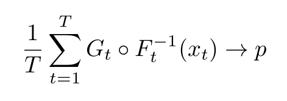

### 1.1.2 measurement

It will evaluated by comparing the frequency of the predictions that are in the confiance interval for each value of alpha. The procedure is as follows:

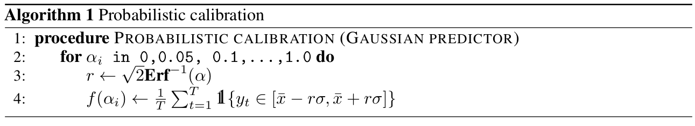

The deviation score is defined as:

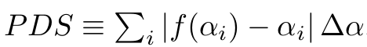

TODO: proof that PDS = 0 => probabilistic calibrated and 
      proof that PDS =/= 0 => not probabilistic calibrated

## 1.2 Exceedance calibration 

### 1.2.1 definition

A predictor is said to be exceedance calibrated if 

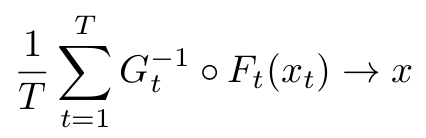

### 1.2.2 measurement

It will evaluated with a one sided comparaison of the cumulative distribution. The procedure is as follows:

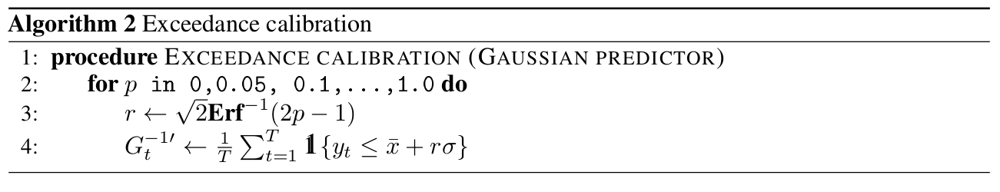

The deviation score is defined as:

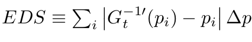

TODO: proof that EDS = 0 => exceedance calibrated and 
      proof that EDS =/= 0 => not exceedance calibrated

## 1.3 Marginal calibration 

### 1.3.1 definition

A predictor is said to be marginally calibrated if 

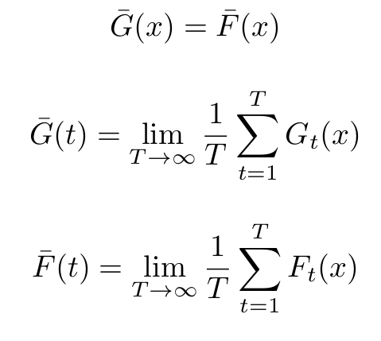

### 1.3.2 measurement

It will evaluated by comparing the cumulative distribution of the observation with the one from the prediction. The procedure is as follows:

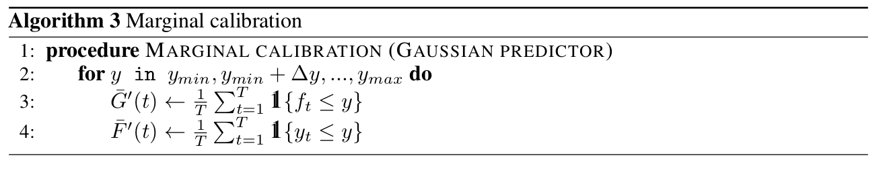

The deviation scoring for the marginal calibration is defined by

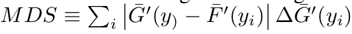

# 2 - Comparing toy forecasters

## 2.1 Ideal forecaster

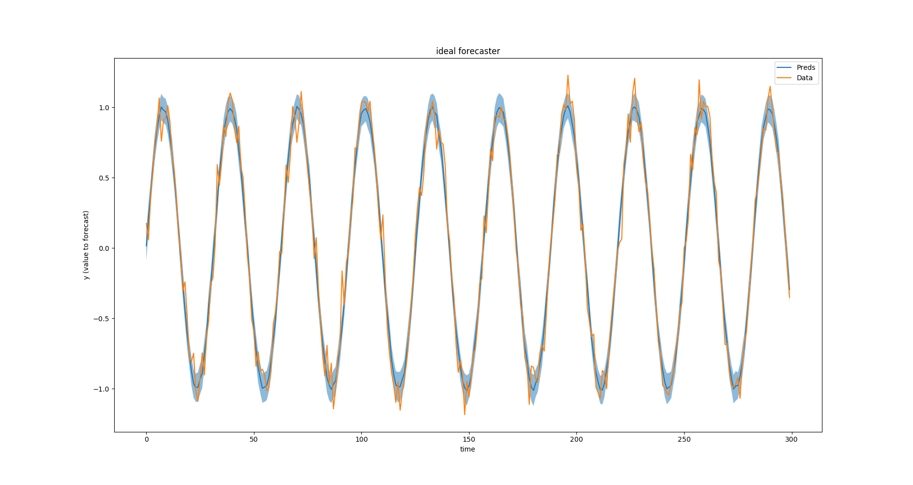
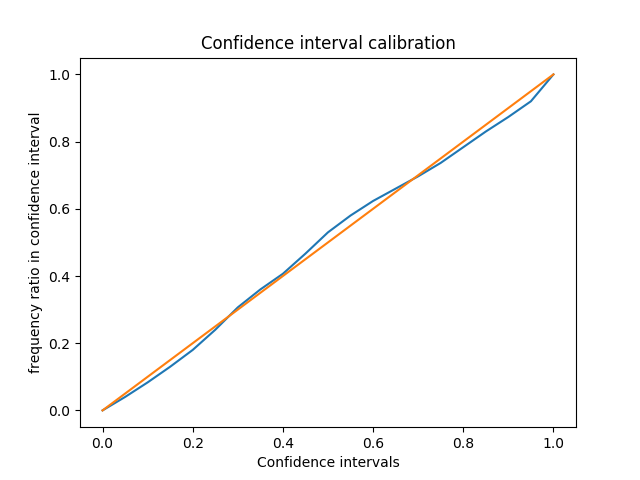
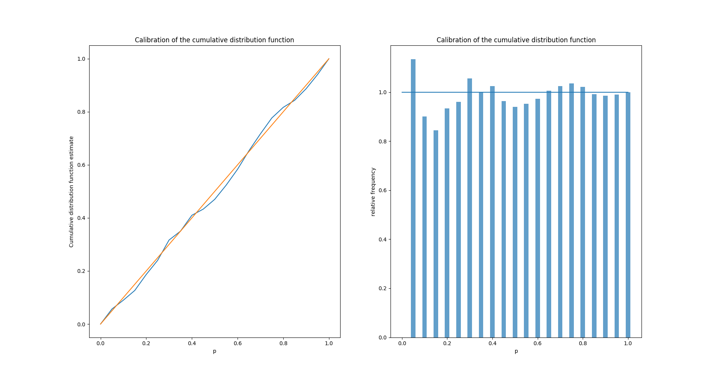
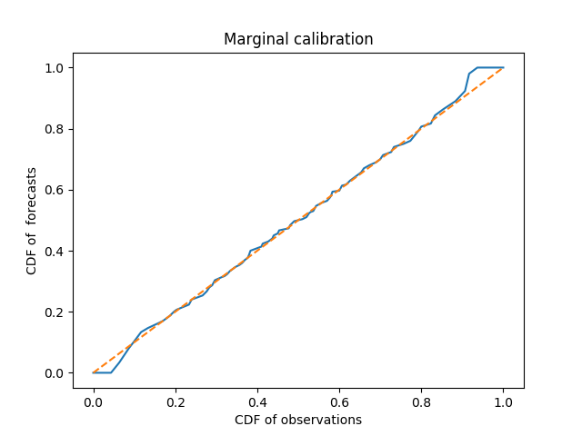

## 2.2 Unfocused forecasster

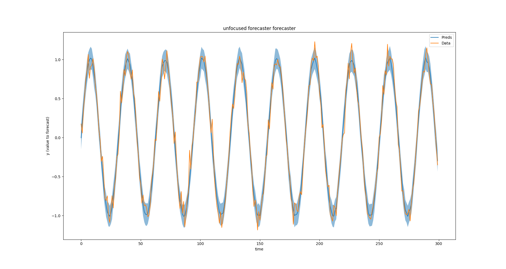
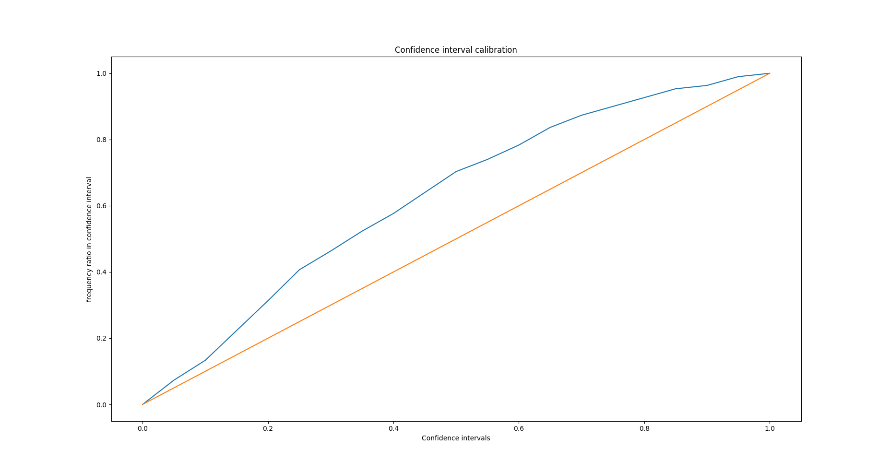
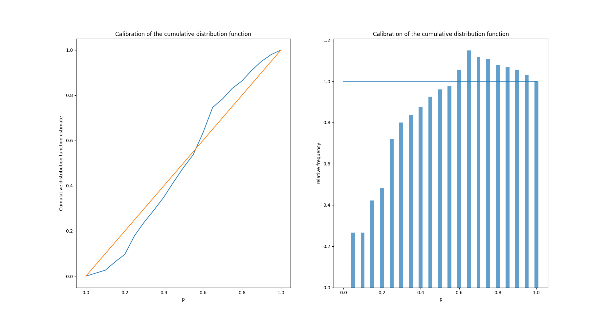
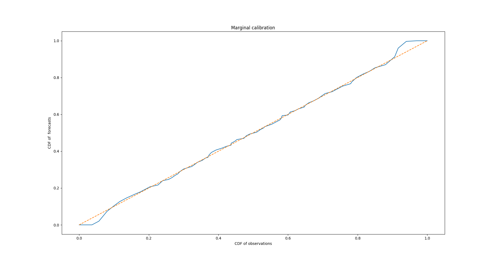

## 2.3 Asymetric bias forecaster

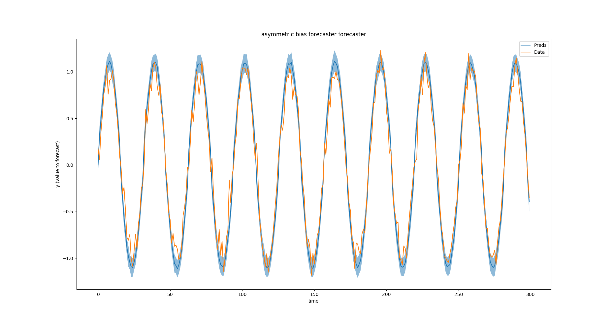
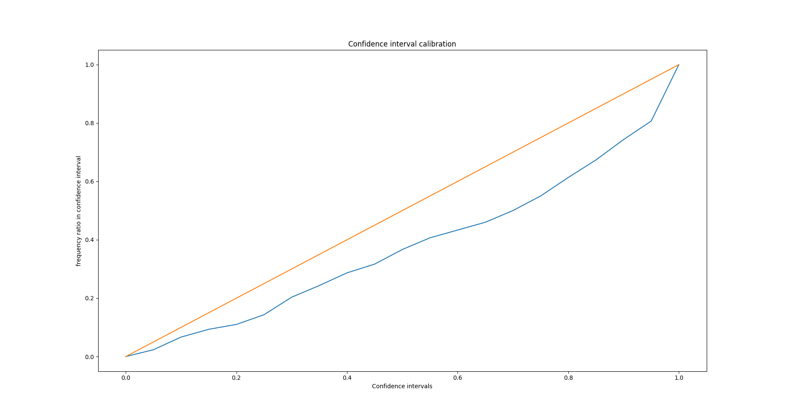
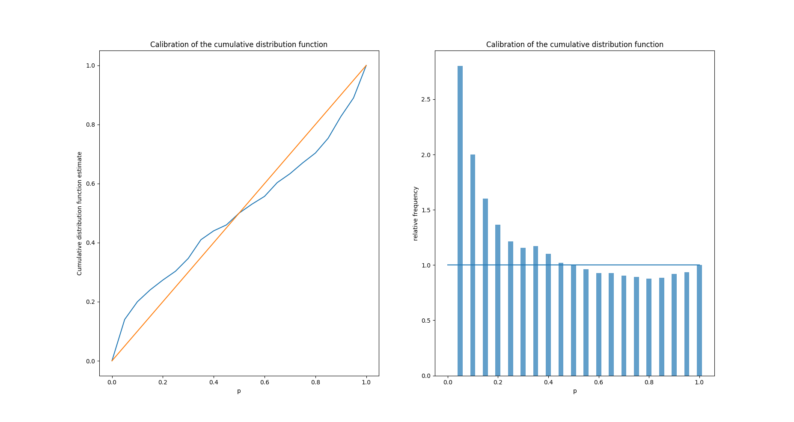
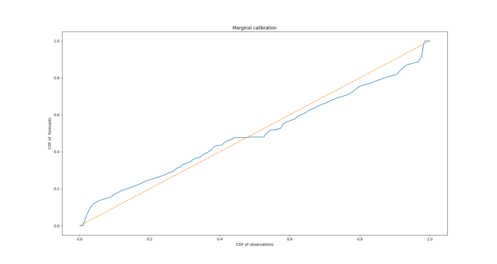

# 3 - LSTM-MCMC forecaster

